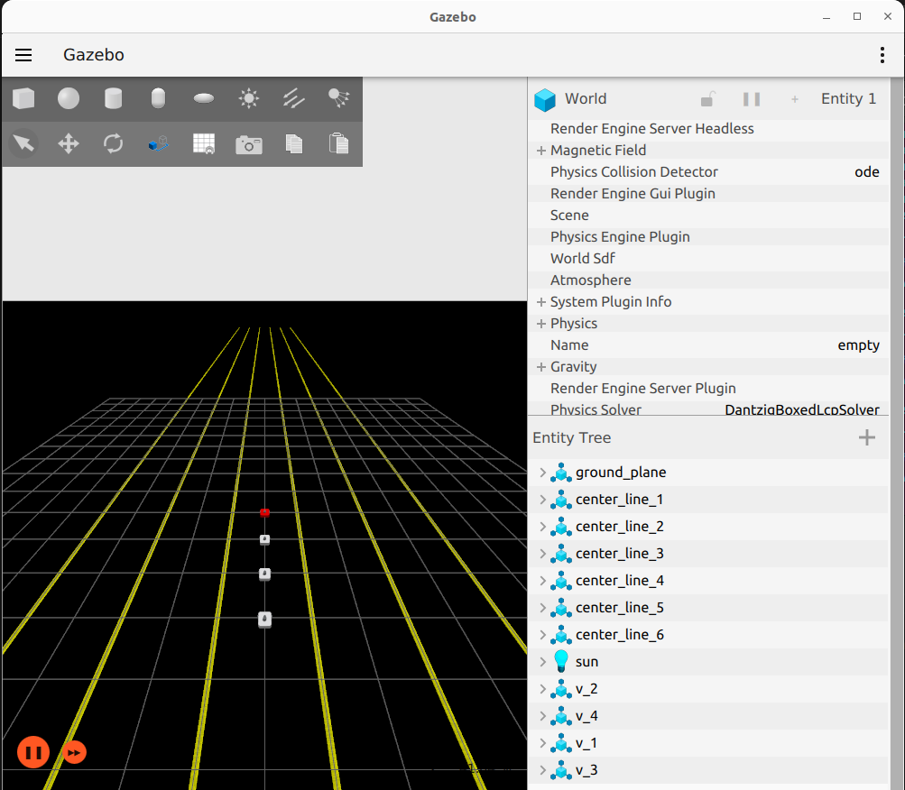
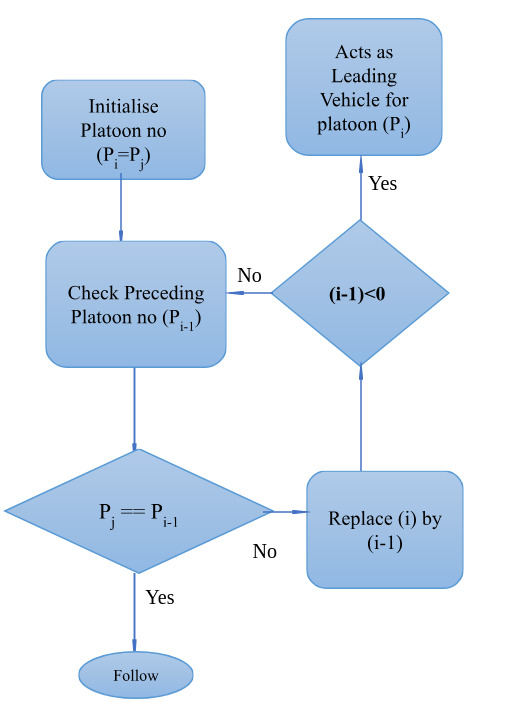
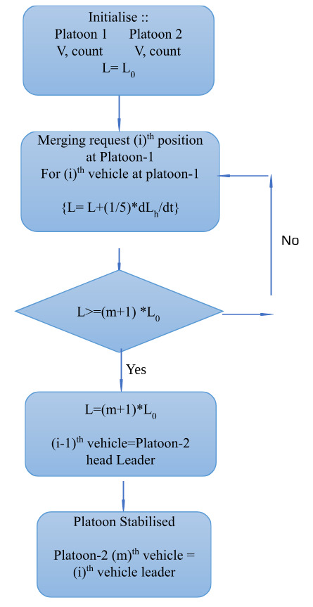

# CO-OPERATIVE DECISION MAKING IN AUTONOMOUS VEHICLE PLATOONS 
A project by [Ashnidh Khandelwal](mailto:ashnidh@gmail.com) ([@Ashnidh](https://github.com/Ashnidh)), Harshit Singh ([@Kush-neufc](https://github.com/Kush-neufc)), Poojitha Sabbineni ([@Poojitha-Sabbineni](https://github.com/Poojitha-Sabbineni)) and Piyush Bhivgade under supervision of [Prof. Arnab Dey](mailto:arnab.dey@ee.iitr.ac.in), EED IIT Roorkee.
## Introduction
This document provides a comprehensive review of the project taken as a part of 'Industry Oriented Problem'.
This document includes -
- setting up the simulation environment on your local system
- a thorough review of the problem statement
- algorithms to implement solutions according to PS
- some improvements in the discussed algorithms and suggestions for future work
- simlulation results and code repositories

## Setting up simulation environment
- You system should have ubuntu-22.04 LTS Desktop installed (either dual booted with windows or completely ubuntu 22).
- In case you don't have ubuntu-22.04 dual boot, you can follow this tutorial [dual boot ubuntu-22.04](https://www.youtube.com/watch?v=QKn5U2esuRk).

## Environment setup with ROS2 & Gazebo

### 1. First update the debian packages on your system :  
- Run these commands in your terminal
```
sudo apt update
sudo apt upgrade
```
### 2. Install ROS2-humble :
- Follow this tutorial -> [install ros2-humble](https://docs.ros.org/en/humble/Installation/Ubuntu-Install-Debs.html).

- Run this command to permanantly source your ros2 environment
```
echo "source /opt/ros/humble/setup.bash" >> ~/.bashrc
```
- For learning basic ROS2 follow this tutorial -> [ROS2 Tutorial](https://youtube.com/playlist?list=PLLSegLrePWgJudpPUof4-nVFHGkB62Izy&feature=shared)

### 3. Install Ignition Gazebo :
- Follow this tutorial -> [Ignition Gazebo](https://gazebosim.org/docs/fortress/install_ubuntu/)
### 4. Install ROS2 dependencies :
```
sudo apt install python3-colcon-common-extensions
sudo apt install ros-humble-desktop python3-argcomplete
sudo apt install ros-dev-tools
```
### 5. Setting up the ROS2 Workspace with the turtlebot3 package
Create a ROS2 workspace and clone the package:
```
cd ~
mkdir -p ~/turtlebot3_ws/src/
echo 'source ~/turtlebot3_ws/install/setup.bash' >> ~/.bashrc
cd ~/turtlebot3_ws/src/
git clone https://github.com/Ashnidh/platoon_ops_merge_spilt_turtlebot3.git
```
Rename the cloned package to ```turtlebot3```:
```
cd ~/turtlebot3_ws/src/
mv ./platoon_ops_merge_spilt_turtlebot3/ ./turtlebot3
```
Build the workspace:
```
cd ~/turtlebot3_ws
colcon build
```
Launch the simulation environment:
```
ros2 launch turtlebot3 start.launch.py
```
This should open a gazebo window with an output similar to the following:



The following topics should be published - 
```
/clock
/joint_states
/parameter_events
/rosout
/tf_static
/trigger_move
/v_1/cmd_vel
/v_1/platoon_info
/v_1/plot
/v_1/pose
/v_1/ref
/v_1/scan
/v_1/scan/points
/v_2/cmd_vel
/v_2/platoon_info
/v_2/plot
/v_2/pose
/v_2/ref
/v_2/scan
/v_2/scan/points
/v_3/cmd_vel
/v_3/platoon_info
/v_3/plot
/v_3/pose
/v_3/ref
/v_3/scan
/v_3/scan/points
/v_4/cmd_vel
/v_4/platoon_info
/v_4/plot
/v_4/pose
/v_4/ref
/v_4/scan
/v_4/scan/points
```
Now you are all set up to write and run ROS2 nodes.

You can run the following command(in a new terminal) to move the first bot (leader) and the others will follow:
```
ros2 run turtlebot3 test_move.py
```

You can add an obstacle to the gazebo world (a violet cylinder) by changing the world used in ```launch/start.launch.py``` to ```empty_world_cylinder.world```. The follower bots should avoid the obstacle now.
## Problem Statement 
The problem statement consists of two parts - 
- Merging operation of platoons moving on a multi-lane highway system.
- Splitting of a single platoon into two or more platoons.

In a platoon all vehicles must maintain an appropriate safety distance.

The protocol used here is decentralised protocol with leader-follower approach where each vehicle makes its own decision depending on the surrounding environment and has information of the leader vehicle only.For every follower vehicle default leader is its preceding vehicle.


### Splitting :
Case : In a platoon with n vehicles, m specific vechiles split to form a new platoon.
In the splitting operation the two major requirements are :
- Deciding new leaders for each vehicle. As the vehicles decide their trajectories based on the preeeding vehicle information, the leaders(precceding vehicle) for vehicles change during splitting operation.
- Stabilization of platoon(s) after operation i.e. all vehicles maintain appropriate safety distance. Vehicles accelerate to fill the gap left by splitting vehicles.

### Merging :
Case : In a platoon with n vehicles, a platoon with m vechiles merge to form a new platoon.
In the merging operation the major requirements are : 
- Creating space in the platoon for incoming vehicles and deciding new leaders.
- Stabilization of platoon(s) after the completion of merging operation.

## Solution to the problem statement
It consists of three major parts :
### 1. To ensure vehicles accurately follow the trajectory of preceeding vehicle
To implement this part the following research paper must be followed-

'' G. Klanˇ car, D. Matko, and S. Blažiˇ c, “Wheeled mobile robots control
 in a linear platoon,” J. Intell. Robotic Syst., vol. 54, no. 5, pp. 709–731,
 May 2009.'' 

 After implementing this part(upto obstacle avoidance), the vehicles will be able to move in a single line platoon with each vehicle following its preceeding vehicle's trajectory.

 ### 2. Obstacle avoidance 
 Obstacle avoidance will play a crucial part as there are high chances of vehicles colliding into each other during merging and splitting operations. The algorithm for obstacle avoidance is mentioned in the above mentioned(section 3.1). In obstacle avoidance the data for nearest vehicle or obstacle is obtained with the help of Lidar sensor.

 The above mentioned section 1 and 2 are the pre-requisite for merging and splitting operations.

 ### 3. Splitting operation
 In splitting operation we need a variable which will help us to determine the platoon a vehicle will join. Lets say the variable is platoon number.

 In this splitting algorithm each vehicle checks the platoon number of its preceeding vehicle and if it is same as its own platoon number then it follows and if the platoon numbers don't match it checks the vehicle preceding to it and so on. If platoon numbers of all the preceeding vehicles don't match then it becomes the leader of its own platoon.

 The platoon number must be decided with respect to destination. Some target points could be implemented for the same. In this for every vehicle as the platoon number changes, leader gets updated thus the gap created during splitting or the inter-vehicular distance will get taken care of automatically.



 ### 4. Merging operation  
In merging operation we require two variables - platoon number and platoon count. Platoon count stores the number of vehicles in a platoon.
Lets assume there are two platoons platoon 1 and platoon 2. Platoon 2 consists of M vehicles and wants to merge at position i in platoon 1. The distance between i<sup>th</sup> and i-1<sup>th</sup> vehicle is L. The distance between i-1<sup>th</sup> and i<sup>th</sup> vehicle must be increased to (M+1)*L to accomodate the platoon 2. Once the gap is created the i-1<sup>th</sup> vehicle must become the leader of the head of platoon 2. With this, the platoon 2 will merge into platoon 1 and after the merging process is done the leader of the i<sup>th</sup> vehicle of platoon 2 should be shifted to last vehicle of platoon 2 only after it has travelled L distance with platoon 1.

To create a distance of (M+1)*L we are creating a separate reference which starts as L distance and increases upto (M+1)*L. This is done to ensure that i<sup>th</sup> vehicle increases gap from its preceding vehicle while following the same trajectory.



## Important points and Suggestions : 
### 1. Important Points :
- In obstacle avoidance it was observed that the vehicles were not able to avoid the obstacles effectively. So, the magnitude of the vector 'n' in obstacle avoidance which guides the vehicle away from obstacle was increased to 2*n.
- While using the Lidar sensor it is important to limit its range to either 120 degree or 150 degree in front. Otherwise there may be unwanted results in obstacle avoidance.

### Suggestions 
- The controller used in the above algorithm for following the trajectory of preceeding vehicle is proportional controller. PID controller can be implemented for better results.
- In merging operation the position of the joining vehicle is decided beforehand. The decision on position to merge should be taken by vehicle based on the relative position of vehicles in other platoon. A possible hint in this direction is to check for vehicles in 180 degree field of view and then decide.
- The obstacle avoidance algorithm mentioned above takes care of most of the cases. However, it may fail in some of the cases so it may be better to implement an obstacle avoidance algorithm that provides satisfactory results.